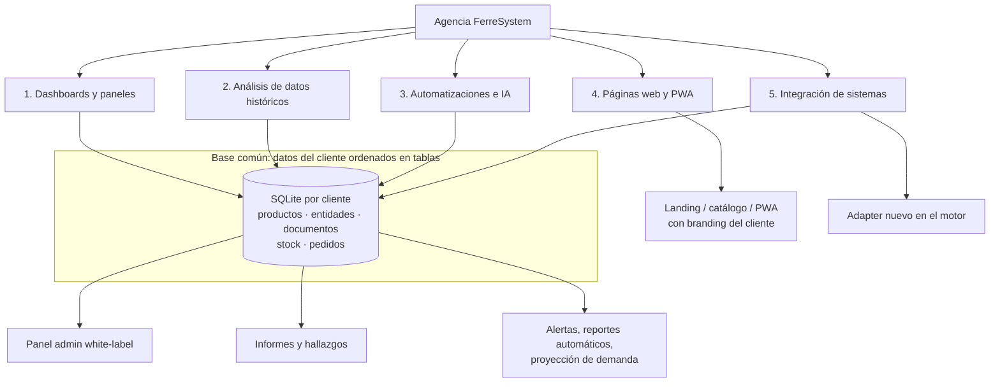
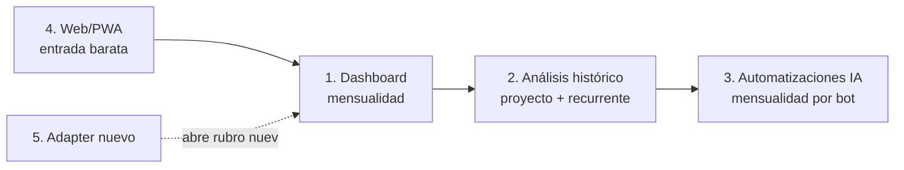

# Catálogo de servicios — Agencia de análisis, IA y web

## Propuesta de valor

FerreSystem deja de ser solo "paneles para ferreterías" y se ofrece como
**agencia de datos e IA para cualquier rubro**: se conecta al sistema que el
cliente ya tiene (ERP, punto de venta, planillas), ordena su historia en tablas
(ver `docs/modelo-datos.md`) y sobre esa base vende análisis, automatizaciones
y presencia web. El mismo motor multi-tenant sirve a todos.

## Diagrama de servicios

La lectura del diagrama es el argumento de venta: **todo servicio se apoya en
la misma base de tablas**. El primer proyecto con un cliente (ordenar sus
datos) habilita todos los siguientes — cada servicio adicional cuesta menos
que el anterior.

## Los 5 servicios

### 1. Dashboards y paneles de gestión

**Qué es:** panel admin / vendedor / cliente white-label, actualizado a diario
desde el sistema del cliente. Es el producto núcleo actual de FerreSystem.

**Para quién:** cualquier negocio con ventas y stock — ferretería, farmacia,
botillería, distribuidora, servicios.

**Tablas que lo sostienen:** todas (`v_ventas`, `stock_snapshot`, `pedidos`).

| Paso | Proceso de venta | Entregable / criterio de salida |
|---|---|---|
| 1 | Prospección: detectar negocio con ERP local y sin dashboards | Contacto interesado |
| 2 | Demo con el panel de ejemplo (branding neutro, datos ficticios) | Reunión hecha, dolor identificado |
| 3 | Diagnóstico: qué sistema usa, qué datos expone, qué quiere ver | Ficha técnica del cliente |
| 4 | Propuesta: alcance, precio de implementación + mensualidad | Propuesta firmada |
| 5 | Piloto (2–4 semanas): tenant nuevo, adapter, tablas cargadas, panel con SUS datos | Panel funcionando con datos reales |
| 6 | Producción: pipeline diario + capacitación | Cliente usando el panel a diario |
| 7 | Mantención mensual: soporte + mejoras menores | Ingreso recurrente |

### 2. Análisis de datos históricos

**Qué es:** consultoría sobre la historia del cliente (idealmente 5–6 años,
ver `docs/plan-carga-historica-2020-2025.md`): estacionalidad, clientes que se
fugan, productos muertos, márgenes reales, concentración de proveedores.

**Para quién:** negocios que llevan años acumulando datos que nunca miraron.

**Tablas que lo sostienen:** `v_ventas_mensual`, `documentos` + `entidades`
(cohortes), `documento_lineas` + `productos` (márgenes).

| Paso | Proceso de venta | Entregable / criterio de salida |
|---|---|---|
| 1 | Gancho: "¿sabes cuánto vendiste de X en 2021 vs hoy?" — el dueño no lo sabe | Interés confirmado |
| 2 | Carga histórica de sus datos a tablas (es el mismo trabajo de la Fase 2 del plan) | Base del cliente poblada |
| 3 | Informe de hallazgos inicial (5–10 hallazgos concretos con números) | Informe entregado y presentado |
| 4 | Propuesta de análisis recurrente (trimestral) o proyectos puntuales | Contrato de análisis |
| 5 | Entrega periódica: informe + recomendaciones accionables | Renovación |

### 3. Automatizaciones e IA

**Qué es:** procesos que corren solos sobre la base del cliente — alertas de
quiebre de stock, reporte diario por correo/WhatsApp, detección de anomalías,
proyección de demanda, asistente que responde preguntas del negocio.

**Para quién:** clientes que ya tienen servicio 1 o 2 (la base ya existe).

**Tablas que lo sostienen:** `v_ventas`, `stock_snapshot` (series de tiempo),
`sync_log` (monitoreo de frescura).

| Paso | Proceso de venta | Entregable / criterio de salida |
|---|---|---|
| 1 | Detectar tarea manual repetitiva del cliente (revisar stock, armar reporte) | Caso de uso concreto |
| 2 | Prototipo de la automatización con sus datos reales | Demo funcionando |
| 3 | Propuesta: implementación + mensualidad por automatización activa | Contrato |
| 4 | Puesta en producción en el pipeline nocturno del tenant | Automatización corriendo sola |
| 5 | Revisión mensual de resultados y ajuste | Renovación / upsell |

### 4. Páginas web y PWA

**Qué es:** landing, catálogo público o PWA instalable con el branding del
cliente — la vitrina digital. Reutiliza el stack ya probado (HTML/CSS/JS +
Firebase Hosting) y el sistema de branding por tenant.

**Para quién:** cualquier negocio sin presencia web decente. Es la puerta de
entrada de menor fricción: no requiere acceso a sus sistemas.

**Tablas que lo sostienen:** opcionalmente `productos` (catálogo público sin
precios sensibles); puede venderse sin datos.

| Paso | Proceso de venta | Entregable / criterio de salida |
|---|---|---|
| 1 | Auditoría exprés de presencia digital del prospecto | Informe de 1 página |
| 2 | Maqueta con su logo/colores (branding/{id}/) | Maqueta aprobada |
| 3 | Propuesta: sitio + hosting + mantención anual | Contrato |
| 4 | Publicación en Firebase Hosting con dominio propio | Sitio en línea |
| 5 | Upsell: "¿y si tu web mostrara tu catálogo real?" → conduce al servicio 1 | Cliente escala de servicio |

### 5. Integración de sistemas (adapters)

**Qué es:** conectar un sistema nuevo al motor — un ERP no soportado, planillas,
un POS. Cada integración es un `adapter` nuevo que queda en el catálogo del
motor y abre ese rubro completo como mercado.

**Para quién:** clientes de los servicios 1–3 cuyo sistema aún no está soportado.

**Tablas que lo sostienen:** el adapter puebla las mismas tablas estándar — esa
es la venta: "sea cual sea tu sistema, tus datos quedan en el formato que
habilita todo lo demás".

| Paso | Proceso de venta | Entregable / criterio de salida |
|---|---|---|
| 1 | Levantamiento: cómo expone datos el sistema (SQL, API, archivos) | Ficha técnica |
| 2 | Prueba de extracción (solo lectura) de las 4 entidades del contrato | Datos de muestra extraídos |
| 3 | Propuesta: desarrollo del adapter (precio fijo) | Contrato |
| 4 | Adapter + tests + carga inicial a tablas | `adapters/{sistema}_adapter.py` operativo |
| 5 | El cliente queda habilitado para los servicios 1–3 | Upsell natural |

## Ruta comercial recomendada

- **Entrar barato** (web) o **entrar por el dolor** (dashboard), y escalar al
  resto sobre la misma base de datos ya construida.
- Cada rubro nuevo se abre con un adapter (servicio 5) y luego se repite la
  escalera con todos los clientes de ese rubro.

## Requisitos antes de salir a vender

1. **Base de datos del piloto poblada 2020–2025** — es la demo real de los
   servicios 2 y 3 (`docs/plan-carga-historica-2020-2025.md`).
2. **Panel admin enriquecido** con los menús multi-año del roadmap
   (`docs/modelo-datos.md` → "Roadmap del panel-admin").
3. **Landing de la agencia** actualizada con los 5 servicios y este diagrama.
4. **Un caso de éxito documentado** (el piloto, anonimizado si hace falta):
   antes/después con números.
