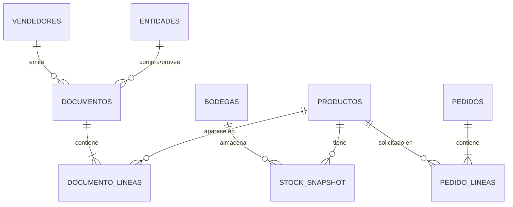

# Modelo de datos — FerreSystem

## Objetivo

Reemplazar el estado actual ("archivos JSON sueltos por tenant") por una **base de
datos SQLite por tenant** que ordena todo el dato histórico en tablas relacionales.
Los JSON que consumen los paneles pasan a ser una *salida generada desde la base*,
no la fuente de verdad.

```
ANTES:  ERP → adapter → JSONs sueltos → paneles
AHORA:  ERP → adapter → SQLite (data/{tenant}/{tenant}.db) → JSONs → paneles
                              │
                              └── análisis, servicios, IA, reportes ad-hoc
```

## Por qué SQLite (y no un servidor SQL)

| Criterio | SQLite |
|---|---|
| Instalación | Ninguna — incluido en el Python del pipeline |
| Portabilidad | Un archivo por tenant, se copia y funciona en cualquier PC |
| Credenciales | No requiere (el archivo vive junto al pipeline, fuera del repo) |
| Volumen esperado | 6 años de historia de un comercio mediano ≈ 100–500 MB |
| Consulta | SQL estándar desde Python, DB Browser o sqlite3.exe |
| Multi-tenant | Un `.db` por tenant → cero datos cruzados (REGLA #0) |

Si un tenant futuro supera el volumen o necesita acceso concurrente de red,
el mismo esquema migra a PostgreSQL sin cambiar el modelo.

## Ubicación y seguridad

- Archivo: `data/{tenant_id}/{tenant_id}.db` — **fuera del repo** (`data/` está
  en `.gitignore`, igual que los JSON de salida).
- Contiene datos sensibles (RUT, razones sociales, ventas): nunca se commitea,
  nunca se publica en hosting.
- Respaldo = copiar el archivo (idealmente con fecha: `{tenant}_YYYYMMDD.db`).

## Esquema de tablas

Extiende las 4 entidades del contrato `core/erp_adapter.py` (Producto, Stock,
Venta, Pedido) a un modelo relacional completo. Todo adapter que ya cumple el
contrato puede poblar estas tablas sin cambios en su lógica de extracción.



### DDL de referencia

```sql
-- Dimensiones
CREATE TABLE productos (
    codigo       TEXT PRIMARY KEY,
    descripcion  TEXT NOT NULL,
    marca        TEXT,
    categoria    TEXT,
    precio       REAL,
    activo       INTEGER DEFAULT 1
);

CREATE TABLE entidades (            -- clientes y proveedores
    rut          TEXT PRIMARY KEY,
    razon_social TEXT NOT NULL,
    tipo         TEXT CHECK(tipo IN ('cliente','proveedor','ambos')),
    sector       TEXT               -- rubro/giro, clave para análisis por segmento
);

CREATE TABLE vendedores (
    id           TEXT PRIMARY KEY,
    nombre       TEXT NOT NULL,
    activo       INTEGER DEFAULT 1
);

CREATE TABLE bodegas (
    codigo       TEXT PRIMARY KEY,  -- código corto (ej. según ERP del tenant)
    nombre       TEXT NOT NULL,
    tipo         TEXT               -- venta / tránsito / merma / gestión...
);

-- Hechos
CREATE TABLE documentos (           -- encabezados: ventas, NC, guías, facturas
    id           INTEGER PRIMARY KEY,
    tipo_doc     TEXT NOT NULL,     -- BVE / FVE / NCE / ... según ERP
    numero       TEXT NOT NULL,
    fecha        TEXT NOT NULL,     -- ISO YYYY-MM-DD
    entidad_rut  TEXT REFERENCES entidades(rut),
    vendedor_id  TEXT REFERENCES vendedores(id),
    total_neto   REAL,
    estado       TEXT,
    UNIQUE(tipo_doc, numero)
);

CREATE TABLE documento_lineas (
    documento_id INTEGER NOT NULL REFERENCES documentos(id),
    linea        INTEGER NOT NULL,
    codigo       TEXT REFERENCES productos(codigo),
    cantidad     REAL NOT NULL,
    precio       REAL NOT NULL,
    neto         REAL NOT NULL,
    bodega       TEXT REFERENCES bodegas(codigo),
    PRIMARY KEY (documento_id, linea)
);

CREATE TABLE stock_snapshot (       -- foto diaria: habilita análisis histórico de stock
    fecha        TEXT NOT NULL,
    codigo       TEXT NOT NULL REFERENCES productos(codigo),
    bodega       TEXT NOT NULL REFERENCES bodegas(codigo),
    cantidad     REAL NOT NULL,
    PRIMARY KEY (fecha, codigo, bodega)
);

CREATE TABLE pedidos (              -- OC / pedidos a proveedor
    numero       TEXT PRIMARY KEY,
    fecha        TEXT NOT NULL,
    proveedor    TEXT REFERENCES entidades(rut),
    estado       TEXT
);

CREATE TABLE pedido_lineas (
    pedido_numero TEXT NOT NULL REFERENCES pedidos(numero),
    linea         INTEGER NOT NULL,
    codigo        TEXT REFERENCES productos(codigo),
    cantidad      REAL NOT NULL,
    pendiente     REAL DEFAULT 0,
    PRIMARY KEY (pedido_numero, linea)
);

-- Control del pipeline
CREATE TABLE sync_log (
    tabla        TEXT NOT NULL,
    periodo      TEXT NOT NULL,     -- YYYY-MM procesado
    filas        INTEGER NOT NULL,
    ok           INTEGER NOT NULL,
    ts           TEXT NOT NULL,     -- timestamp de la corrida
    PRIMARY KEY (tabla, periodo)
);

-- Índices para las consultas de análisis
CREATE INDEX idx_doc_fecha    ON documentos(fecha);
CREATE INDEX idx_lineas_cod   ON documento_lineas(codigo);
CREATE INDEX idx_stock_fecha  ON stock_snapshot(fecha);
```

`sync_log` es la pieza que hace la carga histórica **reanudable**: si la VPN se
corta en 2022-07, la próxima corrida parte exactamente ahí (ver
`docs/plan-carga-historica-2020-2025.md`).

## Vistas de análisis (capa de servicio)

Las consultas que alimentan menús del panel y servicios de análisis se definen
como vistas SQL — así el panel y los reportes usan siempre la misma lógica:

```sql
CREATE VIEW v_ventas AS
SELECT d.fecha, d.tipo_doc, l.codigo, p.descripcion, p.marca, p.categoria,
       l.cantidad, l.neto, d.entidad_rut, e.sector, d.vendedor_id, l.bodega
FROM documentos d
JOIN documento_lineas l ON l.documento_id = d.id
LEFT JOIN productos p ON p.codigo = l.codigo
LEFT JOIN entidades e ON e.rut = d.entidad_rut
WHERE d.estado IS NULL OR d.estado <> 'Nulo';

CREATE VIEW v_ventas_mensual AS
SELECT substr(fecha,1,7) AS periodo, marca, categoria, sector,
       SUM(neto) AS neto, SUM(cantidad) AS unidades
FROM v_ventas GROUP BY 1,2,3,4;
```

## Roadmap del panel-admin — menús nuevos habilitados por las tablas

Con 6 años de historia en tablas, el panel white-label puede crecer con menús
que hoy son imposibles con JSONs del día:

| Menú nuevo | Tablas que lo alimentan | Qué muestra |
|---|---|---|
| Análisis multi-año | v_ventas_mensual | Comparativa 2020–2025 por marca/categoría/sector |
| Estacionalidad | v_ventas_mensual | Patrón mensual promedio por categoría → planificar compras |
| Clientes (cohortes) | documentos + entidades | Clientes nuevos vs recurrentes, frecuencia, ticket promedio, fuga |
| Proveedores | pedidos + pedido_lineas + entidades | Lead time real, cumplimiento, concentración de compra |
| Rotación histórica | v_ventas + stock_snapshot | Cobertura en meses con tendencia, no solo la foto de hoy |
| Márgenes | documento_lineas + productos | Margen por línea/marca/categoría en el tiempo |
| Predicción (IA) | v_ventas_mensual | Proyección de demanda por producto (base para servicios de IA) |

Regla de implementación: cada menú nuevo se alimenta de un JSON generado desde
una vista SQL por `core/json_writer.py` — los paneles siguen siendo estáticos y
white-label, sin conexión directa a la base (misma arquitectura actual).

## Integración con el motor (cambios futuros de código)

1. `core/db_writer.py` (nuevo): recibe las listas de dataclasses del adapter y
   hace `INSERT OR REPLACE` en las tablas. No toca `erp_adapter.py`.
2. `core/pipeline_runner.py`: paso nuevo "persistir en DB" entre descarga y
   generación de JSON. Un cambio, aplica a todos los tenants.
3. `core/json_writer.py`: opción de generar los JSON desde vistas de la DB en
   lugar de desde memoria (permite regenerar sin re-descargar del ERP).

Cada punto es un cambio separado (Safe Change Protocol: un prompt = una función).
